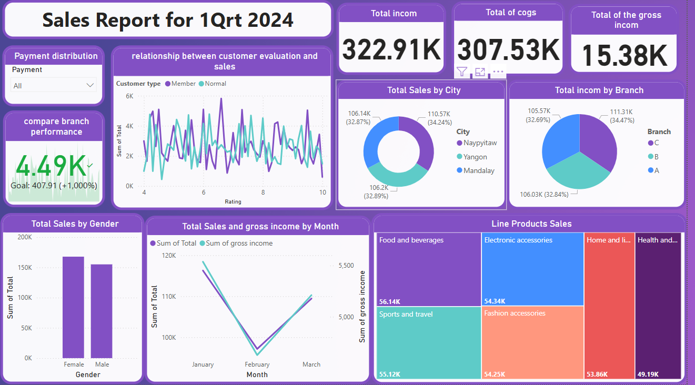

# 📊 Supermarket Sales Dashboard - Power BI
## 📝 Project Overview
This project is a **Power BI dashboard** designed to analyze supermarket sales data. The dashboard provides valuable insights into **sales performance, customer behavior, product profitability, and branch performance**.
## 🎯 Key Features
- **Sales Analysis:** Breakdown of total sales, gross income.
- **Customer Insights:** Relationship between customer ratings and total sales.
- **Branch & City Comparison:** Sales and income comparison across different branches and cities.
- **Product Performance:** Analysis of sales by product line and contribution to total revenue.
- **Payment Distribution:** Insights into customer payment preferences (Cash, Credit Card, E-wallet).
- **Gender-based Sales Analysis:** Understanding sales trends based on customer gender.
- **Monthly Sales Trend:** Visual representation of total sales and gross income over months.
- ## 🛠️ Technologies Used
- **Power BI** for data visualization and dashboard creation.
- **Excel / CSV Dataset** for data storage and preprocessing.
- ## 📂 Project Structure
```
|-- Supermarket_Sales_Dashboard/
    |-- Dataset/
        |-- supermarket_sales.csv
    |-- Reports/
        |-- PowerBI_Dashboard.pbix
    |-- Screenshots/
        |-- Dashboard_Preview.png
    |-- README.md
```
## 📸 Dashboard Preview

## 🤝 Contributing
Contributions are welcome! Feel free to fork the repository and submit pull requests with enhancements or bug fixes.
